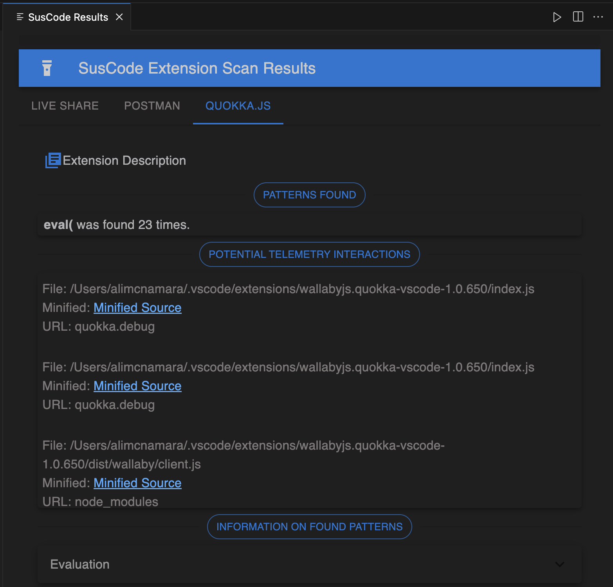
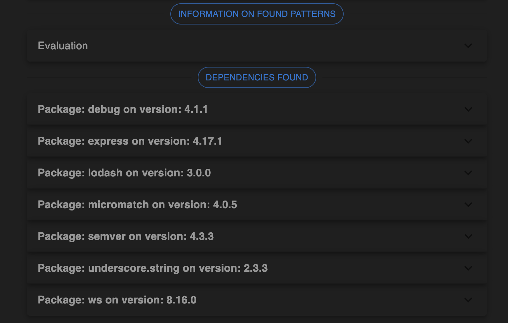

# SusCode README

  

  
  

  

SusCode is a VScode extension built to help every VScode user take the security of their extensions into their own hands. SusCode counteracts both the lack of an extensive permissions protocol and the low threshold for extension security in Microsoft’s Visual Studio Marketplace by searching through your already downloaded extensions and making you aware of patterns, packages, and requests that could increase an extension’s vulnerability to malicious attacks. SusCode stands out as the first application meeting this need within the VScode community.

## How it works

When you download an extension for VScode, that extension’s source code is stored on your local device. SusCode then does the follow to easily bring potential vulnterabilities to your attention:

- SusCode provides a list of your installed extensions, you choose which extension(s) you want to scan.
- SusCode then reads the files that the extension has stored locally and scans for certain code patterns. SusCode is searching specifically for patterns that can introduce vulnerabilities because they often allow the execution of arbitrary code or the insertion of content in a way that is hard to control, potentially exposing the application to attacks.
- For each extension you select, Suscode provides a brief description of the extension (grabbed from it’s own ReadMe.md!) and displays the frequency of each pattern found.
- SusCode also scans these files for HTTP requests and displays the location information along with a direct link to the exact location in the code where the request is being made.
- SusCode also grabs a list of dependencies required by each extension, found in its package.JSON file, and runs it through the Open Source Vulnerabilities (OSV) API and displays the results along with a link to take you to the website so you can see for yourself. This schema has been adopted by many vulnerabilities databases including GitHub Security Advisories, PyPA, RustSesc, and many more.

## Initial Setup & Installation

Once downloading and installing the extension from Visual Studio Marketplace, you're good to go.

  

  
  

Once installed, SusCode will appear as a magnifying glass icon in your activity bar. To activate the extension, simply click on that Icon. Icon provided by [icons8](https://icons8.com/).

  

  
  Once installed, SusCode will appear as a magnifying glass icon in your activity bar. To activate the extension, simply click on that Icon. Icon provided by [icons8](https://icons8.com/).
  

You will then be able to select the extensions you would like to scan...

  

  
  

and a window will open and display the results for each extension in its own tab.

  
    
   
  

## Release Notes

Users appreciate release notes as you update your extension.

### 1.0.0

Initial release of SusCode

| Feature                                                                              | Status |
| ------------------------------------------------------------------------------------ | ------ |
| Scans for potentially vulnerable static code patterns                                | ✅     |
| Informs users of the intended purpose of each extension                              | ✅     |
| Informs users of the potential vulnerabilities of each code pattern found            | ✅     |
| Scans for potential telemetry interactions                                           | ✅     |
| Provides direct clickable link to the telemetry interaction within local source code | ✅     |
| Utilize OSV to provide reputable scan of dependencies                                | ✅     |
| Utilize VirusTotal to provide reputable scan of endpoints                            | ⏳     |
| Notify users when extensions silenty update to encourage supplementary scans         | 🙏🏻     |

- ✅ = Ready to use
- ⏳ = In progress
- 🙏🏻 = Looking for contributors
