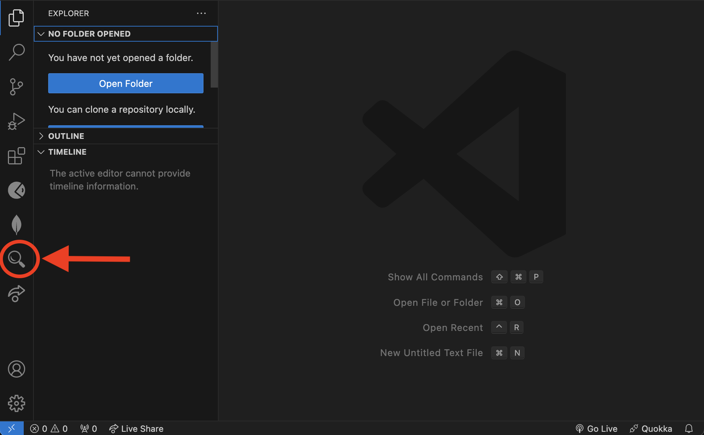
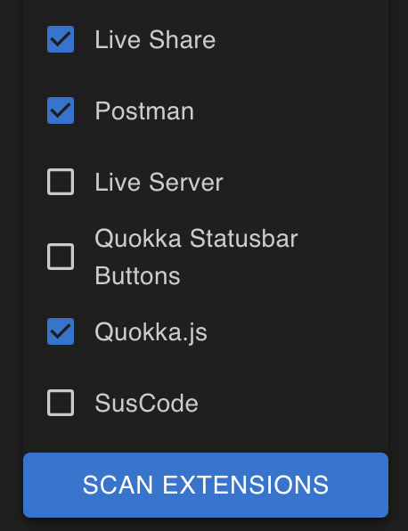
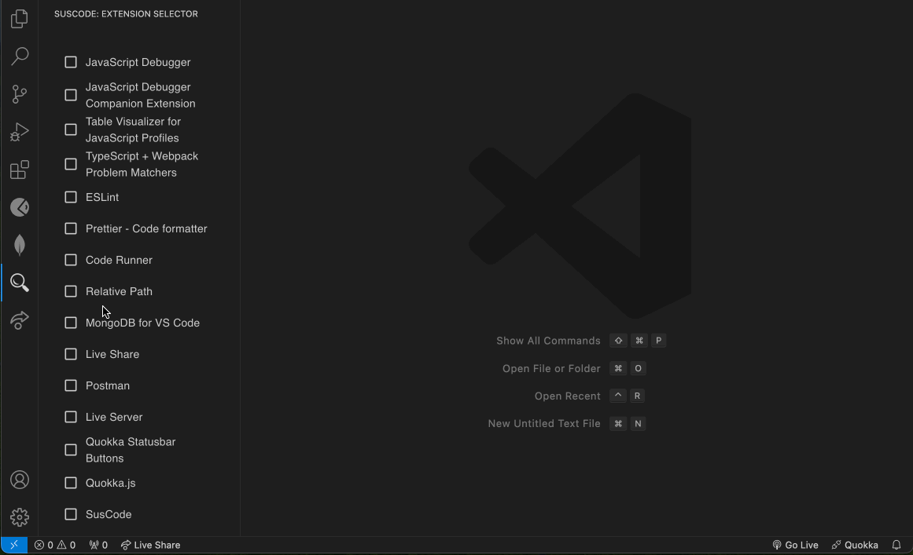
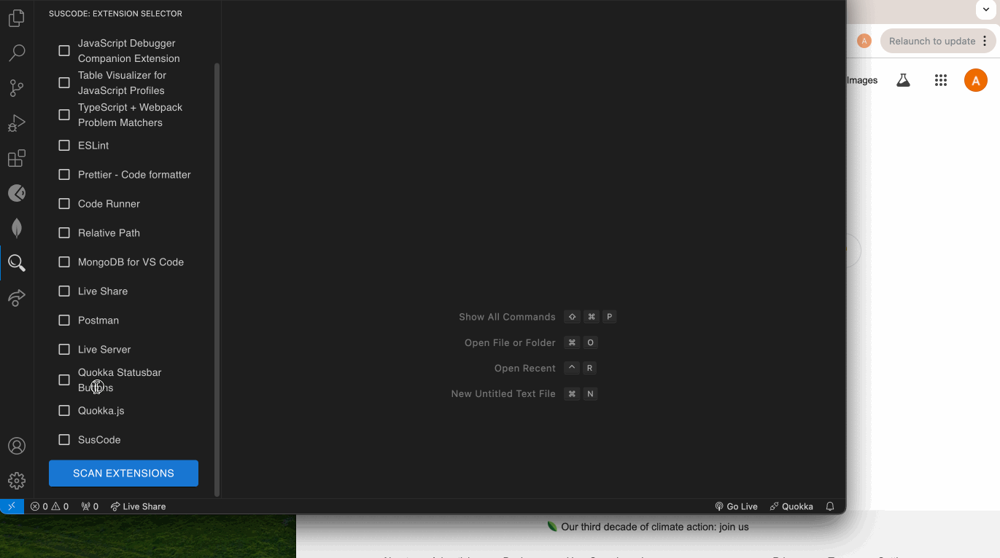
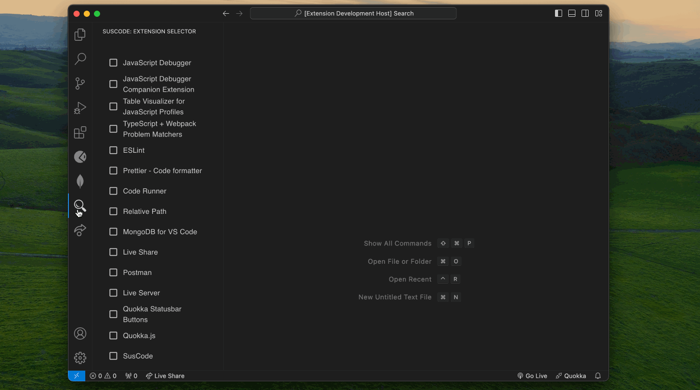

# SusCode README

  

  
  

  

    <a href="https://github.com/oslabs-beta/SusCode/issues/new?assignees=&labels=bug%2Cpending+triage&projects=&template=1_bug_report.yml"> Report Bug</a>
    <a href="https://github.com/oslabs-beta/SusCode/issues/new?assignees=&labels=enhancement%2Cpending+triage&projects=&template=2_feature_request.yml"> Request Feature </a>
  

<!-- BUILT WITH -->

  

    
    
    
    
    
    
  

<!-- TABLE OF CONTENTS -->

  
Table of Contents

  <ul>
    <li>
      <a href="#about-the-extension">About The Extension</a>
      <ul>
        <li><a href="#background-info">Background Info</a></li>
        <li><a href="#our-solution">Our Solution</a></li>
      </ul>
    </li>
    <li><a href="#how-it-works">How it Works</a></li>
    <li><a href="#initial-setup-&-installation">Initial Setup & Installation</a></li>
    <li><a href="#features">Features</a></li>
    <li><a href="#creators">Creators</a></li>
    <li><a href="#license">License</a></li>
    <li><a href="#contact">Contact</a></li>
    <li><a href="#acknowledgments">Acknowledgments</a></li>
  </ul>

<!-- ABOUT THE EXTENSION -->

## About The Extension

### Background Info

VS Code extensions should come with varying levels of access depending on their functionality. For example, ones designed for thematic purposes should have minimal access, while others that analyze files to assist developers might require more extensive permissions. Thus extensions are granted a broad range of permissions.

Although it's best practice for developers to adhere to the principle of least privilege when building extensions, some may exploit these permissions to access sensitive data from users who install malicious extensions unknowingly. This risk is compounded by the fact that extensions can update their codebase without notifying users. As a result, an extension that was initially benign could later become malicious after an update.

### Our Solution

SusCode is a VS Code extension built to help users take the security of their extensions into their own hands. SusCode counteracts both the lack of an extensive permissions protocol and the low threshold for extension security in Microsoft’s Visual Studio Marketplace by searching through your already downloaded extensions and making you aware of patterns, packages, and requests that could increase an extension’s vulnerability to malicious attacks or an extension's own potential malicious activity. SusCode stands out as the first application meeting this need within the VS Code community.

<!-- HOW IT WORKS -->

## How it Works

When you download an extension for VS Code, that extension’s source code is stored on your local device. SusCode then does the following to bring potential vulnerabilities to your attention:

- Provides a list of your installed extensions, you can then choose which extension(s) you want to scan.
- Reads the files in the locally stored extension and scans for certain code patterns. SusCode searches specifically for patterns that can introduce vulnerabilities or are traditionally associated with malicious activity because they often allow the execution of arbitrary code or the insertion of content in a way that is hard to control.
- For each extension you select, Suscode provides a brief description of the extension (grabbed from it’s own ReadMe.md!) and displays the frequency of each pattern found.
- SusCode also scans these files for potential requests to external sources and displays a direct link to the exact location in the code where the request is being made. This is important as it allows you to understand what sort of remote connections your extensions are making, potentially informing you of unsanctioned telemetry or other malicious requests.
- SusCode also grabs a list of dependencies required by each extension found in its package.json file and runs it through the Open Source Vulnerabilities (OSV) API and displays the results along with a link to vulnerbility details listed in the GitHub Security Advisory database. This schema has been adopted by many vulnerability databases including GitHub Security Advisories, PyPA, RustSec, and many more. 
[Click here](https://osv.dev/) to learn more about OSV on their offical website.

<!-- SETUP GUIDE -->

## Initial Setup & Installation

- Once downloading and installing the extension from Visual Studio Marketplace, you're good to go.

  

  
  

- SusCode will appear as a magnifying glass icon in your activity bar:

  

  

- To activate the extension, simply click on that icon. This icon was provided by [icons8](https://icons8.com/).

- You will then be able to select the extensions you would like to scan:

  

  
    

  

- A window will open and display the results for each extension in its own tab.

  
  
     
     
  

<!-- FEATURES -->

## Features

### 0.1.0
Initial release of SusCode

| Feature                                                                                     | Status |
| ------------------------------------------------------------------------------------------- | ------ |
| Customize by selecting the extensions you want to scan                                      | ✅     |
| Scans for potentially vulnerable/malicious static code patterns                             | ✅     |
| Informs users of the potential vulnerabilities of each code pattern found                   | ✅     |
| Informs users of the intended purpose of each extension                                     | ✅     |
| Scans for potential telemetry interactions                                                  | ✅     |
| Provides direct clickable link to the telemetry interaction within local source code        | ✅     |
| Utilize OSV to provide reputable scan of dependencies                                       | ✅     |
| Utilize VirusTotal to provide reputable scan of endpoints                                   | ⏳     |
| Provide links to source code showing where each potentially malicious code pattern exists   | ⏳     |
| Continue to add to the patterns an pattern dictionary for security risk function invocations| ⏳     |
| Additional dev testing                                                                      | 🙏🏻     |
| Notify users when extensions silently update to encourage supplementary scans               | 🙏🏻     |
| Add typosquatting scan/test                                                                 | 🙏🏻     |
| Allow users to choose which scan they want to perform                                       | 🙏🏻     |
| Offer a login option used to store scan history and its results                             | 🙏🏻     |
| A loading animation for scans still in progress                                             | 🙏🏻     |

- ✅ = Ready to use
- ⏳ = In progress
- 🙏🏻 = Looking for contributors

<!-- LICENSE -->
## License

Distributed under the MIT License. See `LICENSE.txt` for more information.

<!-- CREATORS -->
## Creators
+ [Ali McNamara](https://github.com/allisonrm95)
+ [Joyce Oh](https://github.com/joyceoh)
+ [Kenny Olson](https://github.com/AchillesHeir)
+ [Seth Hollingsworth](https://github.com/sethjholl07)
+ [Billy-Jack Dalessandro](https://github.com/bjdooi)

<!-- CONTACT -->
## Contact
 X(Twitter): [@suscode_](https://x.com/suscode_) | [Email Us](mailto:8d7c2b895ad44f9eb6646a4ecad2c949@domainsbyproxy.com?subject=[GitHub]%20Suscode)

 GitHub: https://github.com/oslabs-beta/SusCode/

<!-- ACKNOWLEDGMENTS -->
## Acknowledgements

icons from [icons8](https://icons8.com/)  
logo built with [Canva](https://www.canva.com/)  
landing page inspiration from [Vercel templates](https://vercel.com/templates/next.js)
[Open Source Vulnerabilities (OSV) API](https://github.com/google/osv.dev) used. 

The creation of this extension was inspired by issues from posts such as:
[Github issue](https://github.com/microsoft/vscode/issues/52116) and [Hacker News](https://news.ycombinator.com/item?id=36029020)

(<a href="#readme-top">back to top</a>)
